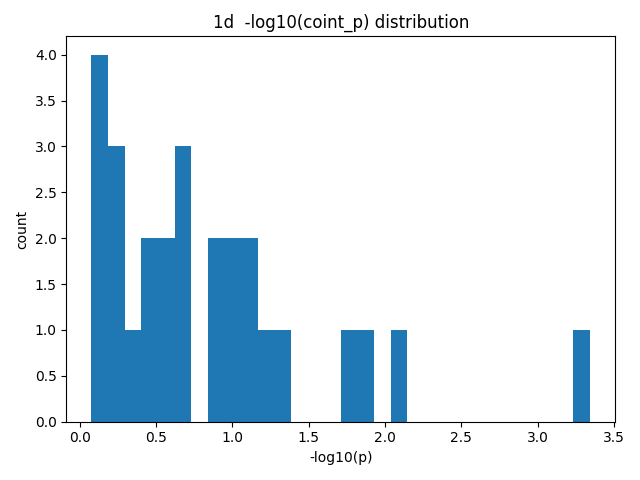
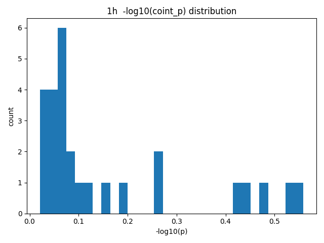
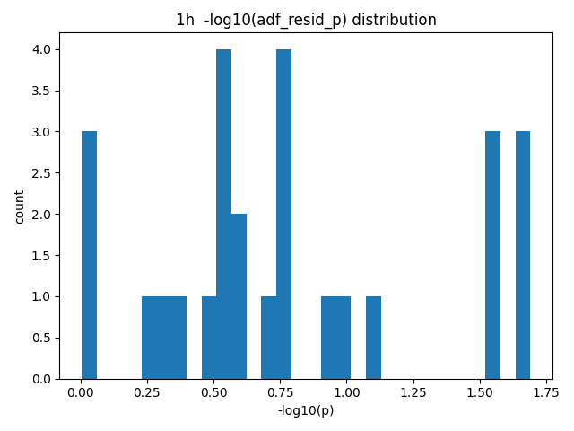
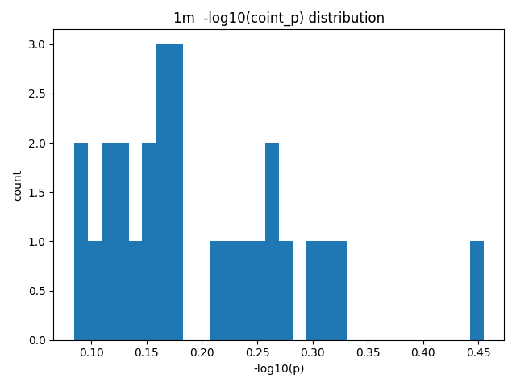
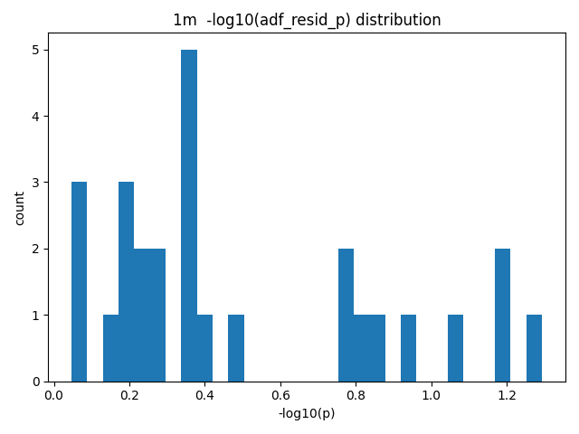

# 업비트 공적분 탐색 보고서

*생성 시각: 2025-08-27 06:42:41 UTC*

## 1) 지표 설명

- **피어슨 상관계수 (r, p)**: 동시시점 상관관계의 선형강도와 유의성입니다. *공적분*은 단기 상관과는 다른 개념이므로, r이 낮아도 공적분일 수 있습니다.
- **Engle–Granger (EG) 공적분 검정**: 두 비정상 시계열 X, Y가 특정 선형결합으로 정상성을 가지는지(=장기균형관계 존재)를 검정합니다. 여기서는 `coint_p`가 작을수록 공적분 증거가 강합니다.
- **잔차 ADF (단위근) 검정**: 회귀 \(Y_t = \alpha + \beta X_t + e_t\)의 잔차 \(e_t\)가 정상성을 가지는지를 검정합니다. `adf_resid_p`가 작을수록 정상성(=공적분 일관성) 증거가 강합니다.
- **헤지비율(OLS β)**: EG 1단계 회귀에서의 기울기 추정치로, 스프레드 구성 \(e_t = Y_t - \alpha - \beta X_t\)에 쓰입니다.
- **리드 테스트**: 본 연구는 (X(t), Y(t+k))를 검정합니다. 즉 Y를 k스텝 **리드**하여 미래값이 X의 현재와 장기관계를 갖는지 확인합니다. 전략화 단계에서는 미래정보 누출을 피하기 위해 롤링/아웃오브샘플 검증이 필수입니다.
- **판정 기준**: 기본 5% 유의수준에서 `coint_p<0.05` AND `adf_resid_p<0.05`를 **엄격한(Strict)** 기준으로, 둘 중 하나라도 5%면 **완화(Loose)** 증거로 표기했습니다. 또한 (timeframe, k) 그룹 내부에서 **Benjamini–Hochberg FDR(0.05)**로 다중검정을 보정했습니다.

## 2) 데이터 및 방법

- 거래소: **Upbit KRW 마켓** (X=KRW-BTC, Y=상위 9개 알트)
- 캔들: 1분봉 1000개, 1시간봉 500개, 1일봉 100개 (요청 시점 기준 과거)
- 리드(선행) 라그: k ∈ {3, 5, 10}
- 공적분 검정: EG + 잔차 ADF, 유의수준 α=0.05, FDR q=0.05
- 실험 대상 페어 수: 81  (결측 제거 및 표본<30 제외 후 기준)
- 사용 표본 개수 통계(관측치 n_obs):
| timeframe   |   min |   max |    mean |
|:------------|------:|------:|--------:|
| 1d          |   100 |   100 | 100     |
| 1h          |   499 |   500 | 499.963 |
| 1m          |   591 |  1000 | 953.296 |

## 3) 결과 요약

### 3.1 전체 Top 페어 (엄격 기준; both_5)

- **KRW-XRP** | tf=1d, k=3, n=100,  score=7.06, coint_p=4.53e-04, adf_p=1.92e-04, β=0.0000805843

### 3.2 타임프레임별 Top 3 (엄격 기준)

- 1d:

- **KRW-XRP** | tf=1d, k=3, n=100,  score=7.06, coint_p=4.53e-04, adf_p=1.92e-04, β=0.0000805843
- **KRW-CKB** | tf=1d, k=5, n=100,  score=4.59, coint_p=1.18e-02, adf_p=2.17e-03, β=0.0000001283
- **KRW-XRP** | tf=1d, k=5, n=100,  score=4.46, coint_p=9.05e-03, adf_p=3.87e-03, β=0.0000780265

### 3.3 (timeframe, k)별 유의 페어 수

| timeframe   |   lag_k |   n_pairs |   n_coint_5 |   n_adf_5 |   n_both_5 |   n_bh_both |   avg_n_obs |
|:------------|--------:|----------:|------------:|----------:|-----------:|------------:|------------:|
| 1d          |       3 |         9 |           2 |         4 |          2 |           1 |     100     |
| 1d          |       5 |         9 |           2 |         5 |          2 |           0 |     100     |
| 1d          |      10 |         9 |           0 |         2 |          0 |           0 |     100     |
| 1h          |       3 |         9 |           0 |         2 |          0 |           0 |     500     |
| 1h          |       5 |         9 |           0 |         2 |          0 |           0 |     500     |
| 1h          |      10 |         9 |           0 |         2 |          0 |           0 |     499.889 |
| 1m          |       3 |         9 |           0 |         0 |          0 |           0 |     954.111 |
| 1m          |       5 |         9 |           0 |         0 |          0 |           0 |     953.667 |
| 1m          |      10 |         9 |           0 |         0 |          0 |           0 |     952.111 |

## 4) 해석 가이드 & 추천

- **가장 공적분에 잘 맞는 페어**는 (a) `both_5`를 만족하고, (b) `score=-log10(coint_p)-log10(adf_p)`가 큰 순입니다.
- 동일 (timeframe, k) 내 다중검정 보정(BH-FDR 5%)을 통과한 `bh_both` 페어는 보다 **견고한 후보**로 간주할 수 있습니다.
- 실전 전략화 시:
  1) 롤링 윈도우로 β/α 재추정 및 스프레드 정상성 재검정(워크포워드)  
  2) 스프레드 z-score 엔트리/청산 + 거래비용/슬리피지 반영 백테스트  
  3) 라그(k) 및 주기별 민감도 분석, 안정성 높은 조합 선호

## 5) p-value 분포 도표

